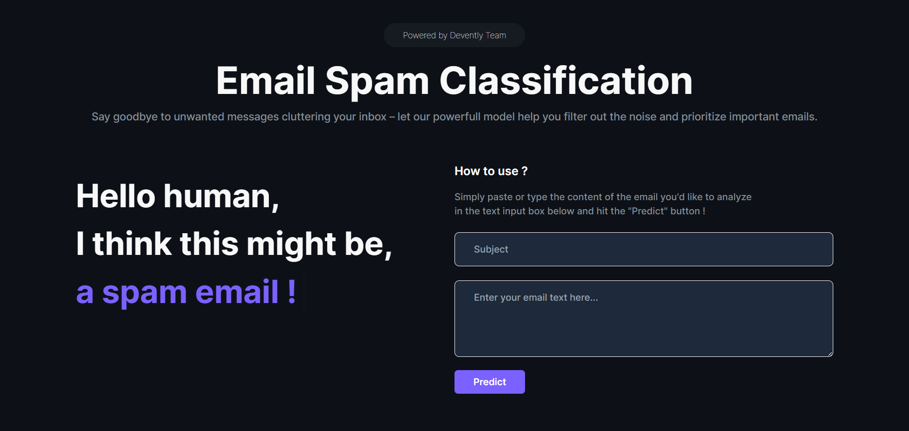

# Email Spam Classification



This repository contains a machine learning model for detecting spam emails using Natural Language Processing techniques and Semi-supervised learning, such as Label Propagation, Label Spreading and Self-Learning. The goal is to create an effective and efficient spam detection system that can classify emails as spam or non-spam with high accuracy.

## Setup

1. Create and activate your virtual environment.

2. Install the dependencies:

   ```bash
   npm install
   ```

3. Install the required packages:

   ```bash
   pip install fastapi scikit-learn uvicorn imbalanced-learn nltk
   ```

## Getting Started

To test this spam detection model, follow these steps:

1. Start the server:

   ```bash
   uvicorn spam_detection_api:app --reload
   # or
   uvicorn spam_detection_api:app --reload --port 8001
   ```

2. Start the development server:

   ```bash
   npm run dev
   ```

3. Open `http://localhost:5173` with your browser to see the result.

4. You are all set 🎉

## Maintainers

This project is mantained by:

- [Adel Mokadem](https://github.com/AdelCSE)
- [Abdelnour Fellah](https://github.com/abdelnour13)
- [Yacine Benyamina](https://github.com/Phues)
- [Abderrahmene Benounene](https://github.com/abderrahmenex86)

## Contributions

Feel free to contribute to the project by opening issues, submitting pull requests, or providing feedback. Your contributions are highly welcome!
